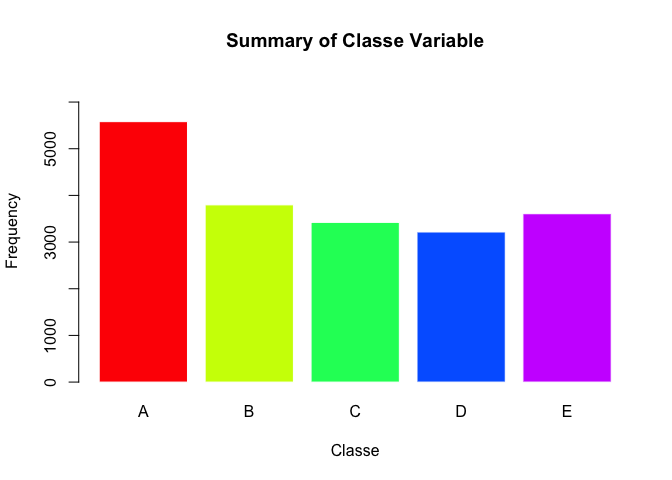
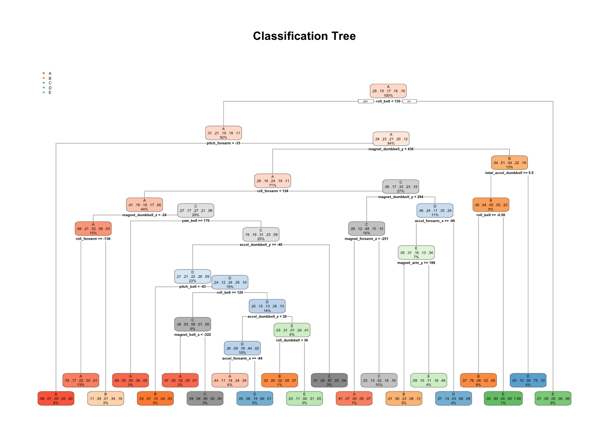

# Summary:
As part of peer graded assignment in the Practical Machine Learning Course, we shall work on building a model based on given data and use it to predict certain variables.


### Background:
One thing that people regularly do is quantify how much of a particular activity they do, but they rarely quantify how well they do it. In this project, your goal will be to use data from accelerometers on the belt, forearm, arm, and dumbell of 6 participants. They were asked to perform barbell lifts correctly and incorrectly in 5 different ways. More information is available from the website here: <http://web.archive.org/web/20161224072740/http:/groupware.les.inf.puc-rio.br/har>

Six young health participants were asked to perform one set of 10 repetitions of the Unilateral Dumbbell Biceps Curl in five different fashions: exactly according to the specification (Class A), throwing the elbows to the front (Class B), lifting the dumbbell only halfway (Class C), lowering the dumbbell only halfway (Class D) and throwing the hips to the front (Class E).

### Reference:
Velloso, E.; Bulling, A.; Gellersen, H.; Ugulino, W.; Fuks, H. Qualitative Activity Recognition of Weight Lifting Exercises. Proceedings of 4th International Conference in Cooperation with SIGCHI (Augmented Human '13) . Stuttgart, Germany: ACM SIGCHI, 2013.

### Data: 

The training data for this project are available at: 

<https://d396qusza40orc.cloudfront.net/predmachlearn/pml-training.csv>

The test data are available at: 

<https://d396qusza40orc.cloudfront.net/predmachlearn/pml-testing.csv>

### Goal:
The goal of your project is to predict the manner in which they did the exercise. This is the "classe" variable in the training set. 

Below are the steps we undertake to build a model


### Getting Data and removing NA strings:

```r
Trainfileurl <- "https://d396qusza40orc.cloudfront.net/predmachlearn/pml-training.csv"
testfileurl <- "https://d396qusza40orc.cloudfront.net/predmachlearn/pml-testing.csv"
Build_data <- read.csv(Trainfileurl,header=T,stringsAsFactors=FALSE,na.strings=c("NA","#DIV/0!",""))
test_data <- read.csv(testfileurl,header=T,stringsAsFactors=FALSE,na.strings=c("NA","#DIV/0!",""))
```

### Exploring Data:
- *Dimensions of the training data:*

```r
dim(Build_data) 
```

```
## [1] 19622   160
```

- *Summary of 'Classe' variable:*


```r
barplot(table(Build_data$classe),col=rainbow(5),border = F,ylim = c(0,6500),ylab = "Frequency",xlab="Classe",main="Summary of Classe Variable")
```

<!-- -->

### Removing Unwanted fields (both Build and Testing Data):

```r
Build_data_modf <- Build_data[,-c(1:7)]
test_data_modf <- test_data[,-c(1:7)]

#Keeping only columns which have data populated
Build_data_modf<-Build_data_modf[,colSums(is.na(Build_data_modf)) == 0]
test_data_modf <-test_data_modf[,colSums(is.na(test_data_modf)) == 0]

#Coverting 'Classe' variable to type factor for cross tabulation
Build_data_modf$classe <- as.factor(Build_data_modf$classe)
```

### Creating Training (70%) and Validation(30%) set:
We shall now split our Build Data into a training set and Validation set by 70:30 ratio. This helps in cross validation and measure our models' accuracy. We select by using random sampling without replacement. 

```r
set.seed(1398)
inTrain <- createDataPartition(y=Build_data_modf$classe,
                               p=0.70, list=FALSE)
Train_data <- Build_data_modf[inTrain,]
Validate_data <- Build_data_modf[-inTrain,]
```

- *Dimensions of Training & Validation data set:*

```r
dim(Train_data);dim(Validate_data)
```

```
## [1] 13737    53
```

```
## [1] 5885   53
```


### Fitting Model 1 using R part:
Here we fit a model using the R Part function used for modelling with classification trees, especially when prediciting factor variables.

```r
fitModel1 <- rpart(classe~.,data=Train_data,method="class")
predictModel1 <- predict(fitModel1,newdata = Validate_data,type="class")
confusionMatrix(predictModel1,Validate_data$classe)
```

```
## Confusion Matrix and Statistics
## 
##           Reference
## Prediction    A    B    C    D    E
##          A 1531  191   72  112   44
##          B   40  668   96   92   80
##          C   45  149  772  128  128
##          D   34   82   62  519   48
##          E   24   49   24  113  782
## 
## Overall Statistics
##                                           
##                Accuracy : 0.7259          
##                  95% CI : (0.7143, 0.7373)
##     No Information Rate : 0.2845          
##     P-Value [Acc > NIR] : < 2.2e-16       
##                                           
##                   Kappa : 0.6512          
##                                           
##  Mcnemar's Test P-Value : < 2.2e-16       
## 
## Statistics by Class:
## 
##                      Class: A Class: B Class: C Class: D Class: E
## Sensitivity            0.9146   0.5865   0.7524  0.53838   0.7227
## Specificity            0.9005   0.9351   0.9074  0.95407   0.9563
## Pos Pred Value         0.7851   0.6844   0.6318  0.69664   0.7883
## Neg Pred Value         0.9637   0.9041   0.9455  0.91342   0.9387
## Prevalence             0.2845   0.1935   0.1743  0.16381   0.1839
## Detection Rate         0.2602   0.1135   0.1312  0.08819   0.1329
## Detection Prevalence   0.3314   0.1658   0.2076  0.12659   0.1686
## Balanced Accuracy      0.9075   0.7608   0.8299  0.74623   0.8395
```
The confusion matrix and the accuracy field above shows that the model is good but can be better. 


- *A plot of the classification tree :*


```r
rpart.plot(fitModel1,main="Classification Tree")
```

<!-- -->


### Fitting Model 2 using Random Forest
We shall now use random forest, which is considered one of the best method, to fit a model. We undertake the fitting process using the classification split. We also set the training options to use Out of Basket method and choose the BEST function for selection criteria. Since we already worked on a R part model for the training and validation data set, we again split the data afresh into training and validation set for the Random Forest model.  

```r
set.seed(1498)
inTrain2 <- createDataPartition(y=Build_data_modf$classe,
                               p=0.70, list=FALSE)
Train_data2 <- Build_data_modf[inTrain2,]
Validate_data2 <- Build_data_modf[-inTrain2,]
rf_mod <- randomForest(classe ~. , data=Train_data2, method="class",
                       trControl=trainControl(method="oob",selectionFunction = "best"))

rf_predict <- predict(rf_mod,newdata = Validate_data2,type="class")
confusionMatrix(rf_predict,Validate_data2$classe)
```

```
## Confusion Matrix and Statistics
## 
##           Reference
## Prediction    A    B    C    D    E
##          A 1674    5    0    0    0
##          B    0 1126    8    0    0
##          C    0    8 1015    9    0
##          D    0    0    3  955    5
##          E    0    0    0    0 1077
## 
## Overall Statistics
##                                           
##                Accuracy : 0.9935          
##                  95% CI : (0.9911, 0.9954)
##     No Information Rate : 0.2845          
##     P-Value [Acc > NIR] : < 2.2e-16       
##                                           
##                   Kappa : 0.9918          
##                                           
##  Mcnemar's Test P-Value : NA              
## 
## Statistics by Class:
## 
##                      Class: A Class: B Class: C Class: D Class: E
## Sensitivity            1.0000   0.9886   0.9893   0.9907   0.9954
## Specificity            0.9988   0.9983   0.9965   0.9984   1.0000
## Pos Pred Value         0.9970   0.9929   0.9835   0.9917   1.0000
## Neg Pred Value         1.0000   0.9973   0.9977   0.9982   0.9990
## Prevalence             0.2845   0.1935   0.1743   0.1638   0.1839
## Detection Rate         0.2845   0.1913   0.1725   0.1623   0.1830
## Detection Prevalence   0.2853   0.1927   0.1754   0.1636   0.1830
## Balanced Accuracy      0.9994   0.9935   0.9929   0.9945   0.9977
```
There you go. You can see that the model works good as we have a 99.35% accuracy. Our expected Out of Sample error is 0.65%. This model which has high accuracy on a 5000 odd data (validation set) rows will surely work well on the test set data with 20 observations. 

# Final Predictions:
We now use our Random Forest Model on the Test Data set

```r
predictfinal <- predict(rf_mod, newdata=test_data_modf)
predictfinal
```

```
##  1  2  3  4  5  6  7  8  9 10 11 12 13 14 15 16 17 18 19 20 
##  B  A  B  A  A  E  D  B  A  A  B  C  B  A  E  E  A  B  B  B 
## Levels: A B C D E
```
